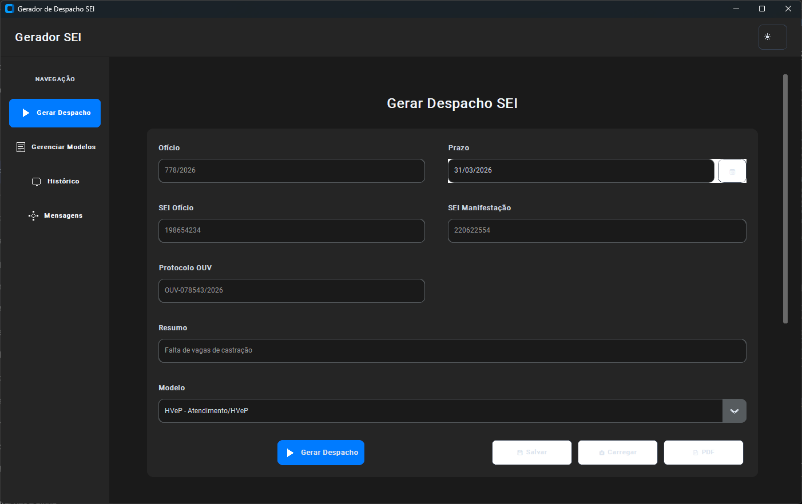

# 🎯 Gerador SEI - v2.0

Uma aplicação desktop moderna e intuitiva para geração de despachos SEI (Sistema Eletrônico de Informações), desenvolvida em Python com interface gráfica elegante usando CustomTkinter.



## ✨ Funcionalidades

### 📝 Geração de Despachos
- **4 Modelos Pré-definidos**: HVEP, Castração, Condições HVEP e Cronograma
- **Modelos Customizáveis**: Adicione, edite, remova ou **duplique** modelos personalizados
- **Campos Validados**: Validação em tempo real com feedback visual (borda colorida)
- **Validação de SEI**: Formato validado automaticamente (4-12 dígitos)
- **Validação de Protocolo**: Formato OUV-XXXX/YYYY com checagem automática
- **Template Engine**: Sistema de placeholders inteligentes ({NUM_OFICIO}, {SEI_OFICIO}, etc.)

### 🎨 Interface Moderna v2.0
- **Design Responsivo**: Layout que se adapta perfeitamente ao tamanho da janela
- **Tema Dark/Light**: Alternância com `F11` com salvamento de preferência
- **Sidebar Retrátil**: Menu de navegação elegante e compacto
- **Tooltips Informativos**: Dicas contextuais em todos os campos
- **Cards Modernos**: Histórico exibido em cards com ações diretas
- **Blocos Agrupados**: Dados visualmente organizados por seção (Documento, Manifestação, etc.)
- **Fonte Monoespaciada**: Apresentação de despachos em Consolas/Courier para melhor legibilidade

### 📊 Gerenciamento Avançado
- **Histórico em Cards**: Últimos despachos com preview e ações de reutilização
- **Busca de Modelos**: Filtro instantâneo na lista de modelos disponíveis
- **Atalhos de Prazo**: Botões rápidos `+5d`, `+15d`, `+30d` para cálculo automático
- **Cálculo de Data**: Função `calcular_data_prazo()` centralizada no engine
- **Reutilizar Dados**: Carregue dados de despachos anteriores com um clique
- **Copiar + Limpar**: Botão dedicado que copia e reseta os campos
- **Persistência de Dados**: Salvamento automático em JSON
- **Exportação PDF**: Geração de documentos formatados
- **Copiar para Clipboard**: Cópia automática com feedback visual

### 🛠️ Recursos Técnicos
- **Validação Robusta**: Checagem em tempo real com feedback imediato
- **Calendário Integrado**: Seletor visual de datas com navegação
- **Atalhos de Teclado**: Navegação rápida (`Ctrl+G`, `Ctrl+S`, `F11`, etc.)
- **Sistema de Mensagens**: Feedback visual com título, mensagem e ícone
- **Observer Pattern**: Sistema de temas com suporte a múltiplos observadores
- **Monitoramento Live**: Validação de campos enquanto você digita

## 🚀 Instalação

### Pré-requisitos
- Python 3.8 ou superior
- pip (gerenciador de pacotes Python)

### Instalação Automática
```bash
# Clone o repositório
git clone https://github.com/seu-usuario/gerador-sei.git
cd gerador-sei

# Instale as dependências
pip install -r requirements.txt
```

### Instalação Manual
```bash
# Instale as bibliotecas necessárias
pip install customtkinter tkcalendar reportlab pandas openpyxl matplotlib
```

## 📖 Como Usar

1. **Execute a aplicação**:
   ```bash
   python gerador_sei.py
   ```

2. **Preencha os campos**:
   - Ofício, Prazo, SEI Ofício, SEI Manifestação, Protocolo OUV, Resumo

3. **Selecione o modelo** e clique em "Gerar Despacho"

4. **Utilize as funcionalidades**:
   - 📋 Copiar texto
   - 💾 Salvar dados
   - 📄 Exportar PDF
   - 📚 Ver histórico

## ⌨️ Atalhos de Teclado

| Atalho | Função |
|--------|--------|
| `Ctrl+G` | Gerar Despacho |
| `Ctrl+S` | Salvar Dados |
| `Ctrl+L` | Carregar Dados |
| `Ctrl+E` | Exportar PDF |
| `Ctrl+Q` | Sair da aplicação |
| `F11` | Alternar Tema (Dark/Light) |
| `.` (data picker) | Abrir calendário |

## 🏗️ Arquitetura

```
gerador_sei/
├── gerador_sei.py      # Aplicação principal (GUI)
├── engine.py           # Lógica de negócio e validações
├── theme_config.py     # Configuração de temas e cores
├── sei_templates.py    # Modelos de despacho pré-definidos
├── sei_utils.py        # Utilitários diversos
├── requirements.txt    # Dependências Python
└── README.md          # Esta documentação
```

### Componentes Principais

- **GeradorSEIApp**: Classe principal da aplicação
- **SEIEngine**: Motor de geração de despachos
- **ThemeManager**: Gerenciador de temas dark/light
- **Screen Classes**: Telas modulares (GenerarScreen, HistoricoScreen, etc.)

## 📁 Estrutura de Dados

### Arquivos de Configuração
- `config.json`: Configurações da aplicação (tema ativo, preferências de UI)
- `dados_ultimo.json`: Últimos dados inseridos (para carregamento rápido)
- `modelos_custom.json`: Modelos personalizados criados pelo usuário

### Formato dos Arquivos JSON

**dados_ultimo.json**
```json
{
  "campo_0": "778/2026",
  "campo_1": "01/05/2026",
  "campo_2": "198654234",
  "campo_3": "220622554",
  "campo_4": "OUV-078543/2026",
  "campo_5": "Falta de vagas de castração",
  "modelo": "HVeP - Atendimento/HVeP"
}
```

**modelos_custom.json**
```json
{
  "Meu Modelo": "Conteúdo do {SEI_OFICIO} com placeholders..."
}
```

### Placeholders Disponíveis
- `{NUM_OFICIO}` - Número do ofício
- `{SEI_OFICIO}` - SEI do ofício
- `{SEI_MANIFESTACAO}` - SEI da manifestação
- `{PROTOCOLO}` - Protocolo OUV
- `{PROTOCOLO}` - Resumo da manifestação
- `{PRAZO}` - Data de prazo calculada
```

## 📋 Changelog (v2.0)

### Novo
- ✨ Atalhos de prazo (`+5d`, `+15d`, `+30d`) para cálculo rápido
- ✨ Cards modernos para exibição do histórico
- ✨ Validação visual em tempo real (cores na borda dos campos)
- ✨ Sidebar retrátil para economia de espaço
- ✨ Busca instantânea de modelos
- ✨ Duplicar modelo existente
- ✨ Botão "Copiar e Limpar" combinado
- ✨ Feedback visual de processamento
- ✨ Função `calcular_data_prazo()` centralizada

### Melhorado
- 🔧 Layout em blocos de seções (Documento, Manifestação, etc.)
- 🔧 Fonte monoespaciada (Consolas) para melhor legibilidade de despachos
- 🔧 Validação de SEI e Protocolo com regex
- 🔧 Status bar com informações de processamento
- 🔧 Histórico com ações diretas (reutilizar, copiar)
- 🔧 Atalhos de teclado expandidos

### Corrigido
- 🐛 Problemas de layout com sobreposição de campos
- 🐛 Erros de tipos no analyzer (Pylance/mypy)
- 🐛 Tratamento de atributos opcional (`None`)

## 🚀 Performance

- ⚡ Carregamento instantâneo de modelos
- ⚡ Filtro de busca sem lag
- ⚡ Renderização de cards otimizada
- ⚡ Cálculo de datas eficiente

## 🤝 Contribuição

1. Fork o projeto
2. Crie uma branch para sua feature (`git checkout -b feature/AmazingFeature`)
3. Commit suas mudanças (`git commit -m 'Add some AmazingFeature'`)
4. Push para a branch (`git push origin feature/AmazingFeature`)
5. Abra um Pull Request

## 📝 Licença

Este projeto está sob a licença MIT. Veja o arquivo `LICENSE` para mais detalhes.

## 🐛 Reportar Problemas

Encontrou um bug ou tem uma sugestão? Abra uma [issue](https://github.com/seu-usuario/gerador-sei/issues) no GitHub.

## 🙏 Agradecimentos

- [CustomTkinter](https://github.com/TomSchimansky/CustomTkinter) - Framework de interface moderna
- [tkcalendar](https://github.com/j4321/tkcalendar) - Widget de calendário
- [ReportLab](https://www.reportlab.com/) - Geração de PDFs
- [PIL](https://python-pillow.org/) - Processamento de imagens

---

**Desenvolvido com ❤️ para facilitar o trabalho com SEI**